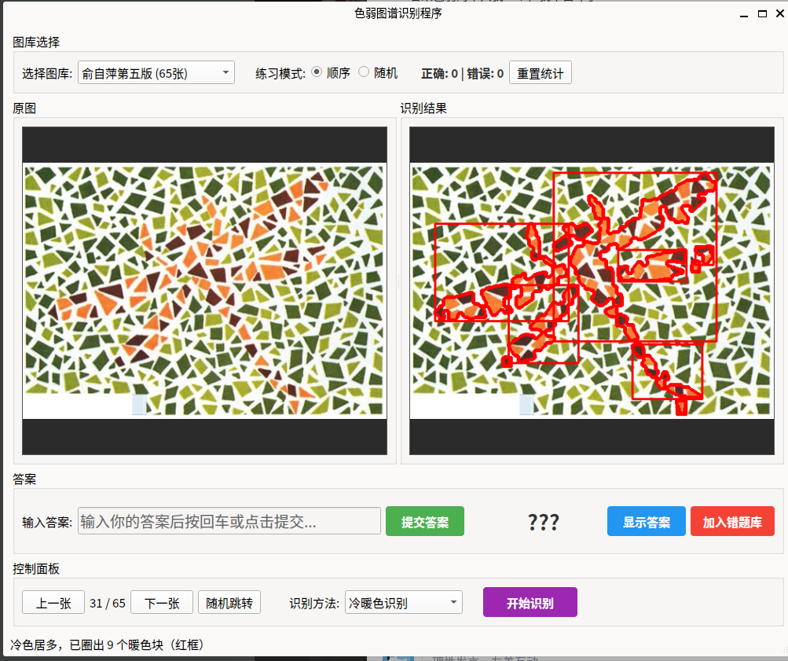

# 色弱图谱识别程序 v1.0.0

一个专业的色觉缺陷检测和辅助系统，基于 PySide6 和 OpenCV 构建，集成了多种先进的色觉测试方法和辅助技术，为色觉缺陷用户提供全面的检测、训练和辅助功能。

## 🎯 核心功能

### 多通道色觉检测
- **红绿通道测试**：专门检测红绿色盲/色弱 (Protan/Deutan deficiency)
- **蓝黄通道测试**：专门检测蓝黄色盲/色弱 (Tritan deficiency)
- **综合多通道分析**：整合分析，提供专业诊断报告
- **快速颜色分析**：简化版本，快速评估色觉状态

### 色觉辅助滤镜系统
- **色觉缺陷辅助**：红色盲、绿色盲、蓝色盲专用滤镜
- **颜色分离技术**：用图案区分难以识别的颜色
- **图像增强**：高对比度、边缘增强、亮度/饱和度调整
- **特殊效果**：灰度、反色等辅助模式

### 智能练习系统
- **多图库支持**：支持多种色觉测试图库，完整Unicode路径支持
- **练习模式**：顺序练习和随机练习
- **答案管理**：自动判分，统计正确率
- **错题库**：自动收集错题，针对性练习
- **符号输入**：快捷符号面板，支持各种测试符号

### 专业测试报告
- **详细分析报告**：JSON格式的专业测试数据
- **诊断结果**：支持7种色觉类型的诊断
- **置信度评估**：提供诊断的可靠性评估
- **历史记录**：保存测试历史，跟踪进展

## 📊 支持的色觉类型

| 类型 | 英文名称 | 中文名称 | 检测方法 |
|------|----------|----------|----------|
| Normal | Normal | 正常色觉 | 综合分析 |
| Protanomaly | Protanomaly | 红色弱 | 红绿通道 |
| Protanopia | Protanopia | 红色盲 | 红绿通道 |
| Deuteranomaly | Deuteranomaly | 绿色弱 | 红绿通道 |
| Deuteranopia | Deuteranopia | 绿色盲 | 红绿通道 |
| Tritanomaly | Tritanomaly | 蓝色弱 | 蓝黄通道 |
| Tritanopia | Tritanopia | 蓝色盲 | 蓝黄通道 |

## 🛠️ 技术特点

### 科学依据
- 基于CIE色彩空间和HSV颜色模型
- 使用色觉混淆线理论进行分析
- 参考国际色觉检测标准

### 算法优势
- 精确的颜色范围定义
- 形态学操作去除噪点
- 连通组件分析识别色块
- K-means聚类分析颜色分布

### 用户体验
- 直观的图形界面
- 实时滤镜预览
- 智能结果管理
- 跨平台兼容
- 完整Unicode路径支持（支持中文、日文、韩文等）

## 🚀 快速开始

### 方式一：使用启动脚本（推荐）

```bash
# 克隆项目
git clone https://github.com/lrm2017/color_weakness_detector.git
cd color_weakness_detector

# 直接启动（自动处理环境）
./run_gui_multichannel.sh
```

### 方式二：手动安装

#### 1. 克隆项目

```bash
git clone https://github.com/lrm2017/color_weakness_detector.git
cd color_weakness_detector
```

#### 2. 创建虚拟环境

```bash
python3 -m venv venv
source venv/bin/activate  # Linux/Mac
# 或 venv\Scripts\activate  # Windows
```

#### 3. 安装依赖

```bash
pip install -r requirements.txt
```

## 🎮 使用指南

### 启动应用

```bash
# 方式1：使用启动脚本
./run_gui_multichannel.sh

# 方式2：直接启动
source venv/bin/activate
python gui_app.py
```

### 基本操作流程

1. **选择图库**：从下拉菜单选择测试图库
2. **浏览图像**：使用导航按钮切换图像
3. **应用滤镜**：选择合适的辅助滤镜
4. **选择检测方法**：
   - 冷暖色识别：传统方法
   - 红绿通道测试：专业红绿色觉检测
   - 蓝黄通道测试：专业蓝黄色觉检测
   - 综合多通道测试：完整诊断报告
   - 快速颜色分析：简化分析
5. **执行检测**：点击开始识别
6. **查看结果**：在右侧查看检测结果
7. **输入答案**：进行练习和评估

### 滤镜使用指南

#### 色觉缺陷辅助滤镜
- **红色盲辅助**：将红色转为蓝色，便于红色盲用户识别
- **绿色盲辅助**：将绿色转为紫色，便于绿色盲用户识别
- **蓝色盲辅助**：将蓝色转为红色，便于蓝色盲用户识别

#### 颜色分离滤镜
- **红绿分离**：用条纹和点状图案区分红绿色
- **蓝黄分离**：用方格和三角形图案区分蓝黄色
- **暖冷色高亮**：用边框标记暖冷色区域

#### 图像增强滤镜
- **高对比度**：增强图像对比度
- **边缘增强**：突出图像边缘
- **亮度增强**：提高图像亮度
- **饱和度增强**：提高颜色饱和度

### 命令行工具

#### 基础色觉检测
```bash
python color_detector.py <图片路径> [-o 输出路径] [--min-area 最小面积] [--show]
```

#### 多通道检测
```bash
# 红绿通道测试
python multi_channel_color_detector.py <图片路径> --channel red_green

# 蓝黄通道测试
python multi_channel_color_detector.py <图片路径> --channel blue_yellow

# 综合测试
python multi_channel_color_detector.py <图片路径> --channel comprehensive
```

#### 滤镜演示
```bash
# 生成所有滤镜效果对比
python demo_filters.py <图片路径> --all

# 演示特定滤镜
python demo_filters.py <图片路径> --demo
```

#### 批量测试
```bash
# 批量处理图库
python batch_color_test.py <图库目录>
```

### 测试图片管理

#### 下载测试图片
```bash
python image_crawler.py
```

#### 处理答案区域
```bash
python mask_fixed.py
```

## 📁 项目结构

```
color_weakness_detector/
├── gui_app.py                    # 主GUI应用
├── color_detector.py             # 原始色觉检测
├── multi_channel_color_detector.py  # 多通道检测器
├── simple_color_test.py          # 简化测试工具
├── color_vision_filters.py       # 色觉辅助滤镜
├── image_utils.py                # Unicode路径支持工具
├── visualize_color_test.py       # 可视化工具
├── batch_color_test.py           # 批量测试工具
├── demo_filters.py               # 滤镜演示脚本
├── demo_multichannel.py          # 多通道演示脚本
├── image_crawler.py              # 图片爬虫脚本
├── mask_fixed.py                 # 答案区域遮挡工具
├── test_unicode_paths.py         # Unicode路径测试
├── requirements.txt              # Python依赖
├── run_*.sh                      # 启动脚本
├── downloaded_images/            # 测试图库
│   ├── 俞自萍第五版/
│   ├── 俞自萍第六版/
│   ├── 王克长第二版/
│   ├── 王克长第三版/
│   ├── 汪润芳第三版/
│   ├── 汪润芳第四版/
│   ├── 李春慧新编/
│   ├── 吴乐正版/
│   ├── 贾永源版/
│   ├── 石原忍版/
│   ├── 空后版/
│   ├── 英文版/
│   └── 错题库/                  # 自动收集的错题
├── test_results/                 # 测试结果目录
├── test_images/                  # 本地测试图片
└── 文档/
    ├── README_multichannel.md    # 多通道功能说明
    ├── 滤镜功能说明.md           # 滤镜详细说明
    ├── GUI_功能说明.md           # GUI功能说明
    ├── 完整功能说明.md           # 完整功能文档
    └── 中文路径支持说明.md       # Unicode支持说明
```

## 🔬 识别原理

### 多通道色觉检测理论

程序基于现代色觉科学理论，使用多通道检测方法：

#### 红绿通道 (Red-Green Channel)
- **检测目标**：Protanopia (红色盲)、Protanomaly (红色弱)、Deuteranopia (绿色盲)、Deuteranomaly (绿色弱)
- **原理**：分析红色和绿色在CIE色彩空间中的分布
- **混淆线**：基于Protan和Deutan混淆线进行分析

#### 蓝黄通道 (Blue-Yellow Channel)  
- **检测目标**：Tritanopia (蓝色盲)、Tritanomaly (蓝色弱)
- **原理**：分析蓝色和黄色的色相分布
- **混淆线**：基于Tritan混淆线进行分析

#### 综合分析
- **K-means聚类**：分析图像颜色分布
- **连通组件分析**：识别色块形状和大小
- **形态学操作**：去除噪点，增强识别精度
- **置信度评估**：提供诊断可靠性评估

### 色觉辅助滤镜原理

#### 颜色替换滤镜
- **红色盲辅助**：将红色(HSV: 0-10, 170-180)转换为蓝色
- **绿色盲辅助**：将绿色(HSV: 40-80)转换为紫色  
- **蓝色盲辅助**：将蓝色(HSV: 100-130)转换为红色

#### 图案分离滤镜
- **红绿分离**：红色区域用斜条纹，绿色区域用圆点
- **蓝黄分离**：蓝色区域用方格，黄色区域用三角形

#### 图像增强滤镜
- **CLAHE算法**：自适应直方图均衡化增强对比度
- **拉普拉斯算子**：边缘检测和增强
- **HSV空间调整**：精确控制亮度和饱和度

### 传统冷暖色识别

**HSV色彩空间范围定义**：

**暖色范围**：
- 红色：H 0-10 和 156-180
- 橙色：H 10-20  
- 黄色：H 20-30

**冷色范围**：
- 黄绿+绿色：H 30-85
- 青色：H 85-105
- 蓝色：H 105-130
- 紫色：H 130-156

**识别策略**：
- 统计暖色和冷色像素数量
- 暖色居多时用蓝色框圈出冷色块
- 冷色居多时用红色框圈出暖色块

## 🎯 识别效果展示

### 多通道检测效果

#### 红绿通道测试
- 精确识别红绿色区域
- 生成专业诊断报告
- 支持Protan/Deutan缺陷检测

#### 蓝黄通道测试  
- 精确识别蓝黄色区域
- 支持Tritan缺陷检测
- 提供置信度评估

#### 综合测试报告
```json
{
  "diagnosis": {
    "type": "Normal",
    "confidence": 0.85,
    "description": "正常色觉"
  },
  "red_green_channel": {
    "red_ratio": 0.25,
    "green_ratio": 0.35
  },
  "blue_yellow_channel": {
    "blue_ratio": 0.20,
    "yellow_ratio": 0.20
  }
}
```

### 滤镜效果展示

#### 色觉辅助滤镜
- 红色盲用户可通过蓝色替换更好识别红色区域
- 绿色盲用户可通过紫色替换更好识别绿色区域
- 蓝色盲用户可通过红色替换更好识别蓝色区域

#### 图案分离效果
- 红绿色用不同图案标记，即使无法区分颜色也能识别
- 蓝黄色用几何图形区分，提供额外的视觉线索

### 传统识别效果

#### 冷色背景示例（圈出暖色块）


#### 暖色背景示例（圈出冷色块）  


#### 错题库示例（正确识别蜻蜓）


**识别能力**：
- 自动判断背景色调
- 动态调整识别阈值  
- 准确圈出数字图形
- 过滤噪点和无关区域

## 📋 系统要求

- **操作系统**：Windows 10+, macOS 10.14+, Linux (Ubuntu 18.04+)
- **Python版本**：Python 3.8+
- **内存**：建议 4GB 以上
- **显卡**：支持OpenGL的显卡（用于GUI渲染）

## 📦 依赖包

### 核心依赖
- **PySide6** (6.0+)：现代化GUI框架
- **OpenCV** (4.5+)：计算机视觉和图像处理
- **NumPy** (1.20+)：数值计算
- **Pillow** (8.0+)：图像处理

### 可选依赖
- **requests** (2.25+)：网络请求（图片下载）
- **beautifulsoup4** (4.9+)：HTML解析（图片爬虫）
- **matplotlib** (3.3+)：数据可视化（可选）

## 🌟 版本历史

### v1.0.0 (2026-01-20)
- ✨ 新增多通道色觉检测系统
- ✨ 新增13种色觉辅助滤镜
- ✨ 完整Unicode路径支持
- ✨ 专业测试报告生成
- ✨ 智能练习和统计系统
- 🐛 修复中文路径读取问题
- 🎨 全新现代化GUI界面
- 📚 完整的文档和使用指南

## 🤝 贡献指南

欢迎提交Issue和Pull Request！

### 开发环境设置
```bash
git clone https://github.com/lrm2017/color_weakness_detector.git
cd color_weakness_detector
python -m venv venv
source venv/bin/activate
pip install -r requirements.txt
```

### 代码规范
- 使用Python 3.8+语法
- 遵循PEP 8代码风格
- 添加适当的注释和文档字符串
- 提交前运行测试

## 📄 许可证

MIT License - 详见 [LICENSE](LICENSE) 文件

## 🙏 致谢

- 感谢所有色觉研究领域的科学家和研究者
- 感谢开源社区提供的优秀工具和库
- 特别感谢色觉缺陷用户提供的宝贵反馈

## 📞 联系方式

- **项目主页**：https://github.com/lrm2017/color_weakness_detector
- **问题反馈**：https://github.com/lrm2017/color_weakness_detector/issues
- **功能建议**：欢迎在Issues中提出

---

**注意**：本程序仅供学习和辅助使用，不能替代专业的医学诊断。如需准确的色觉检测，请咨询专业眼科医生。
